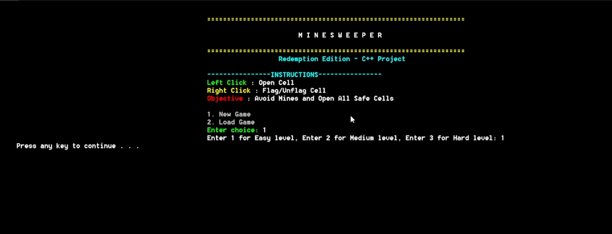
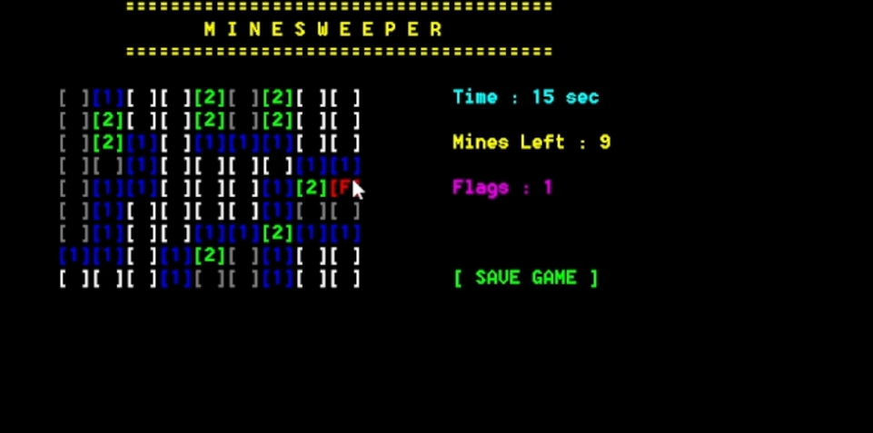
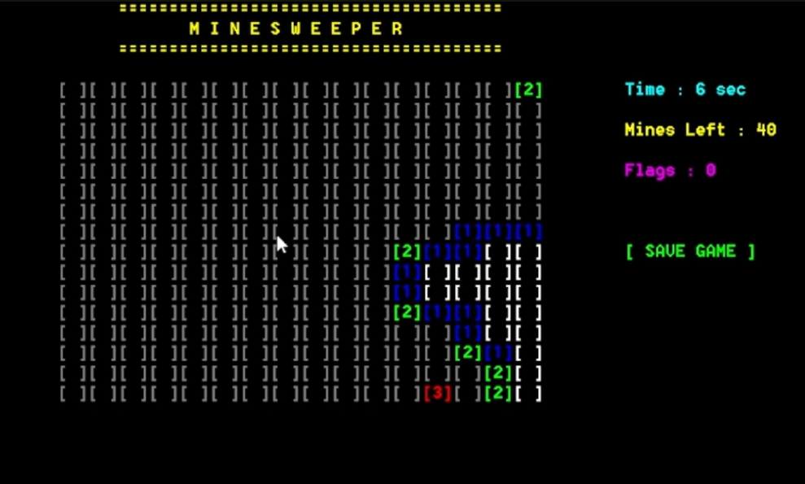
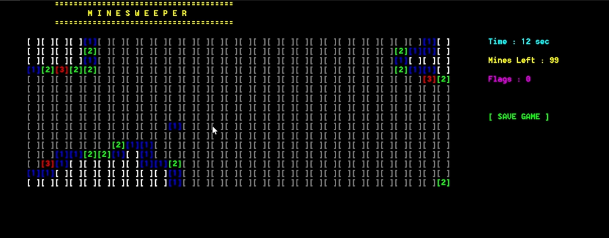
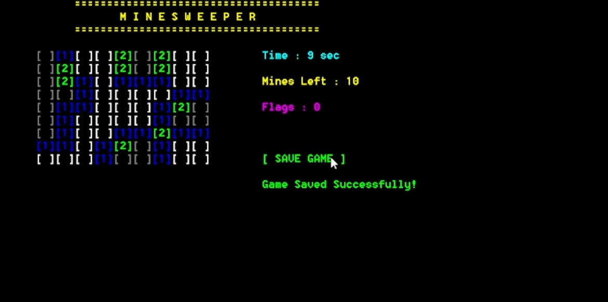
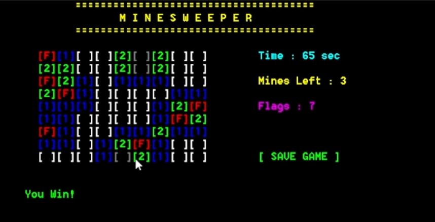
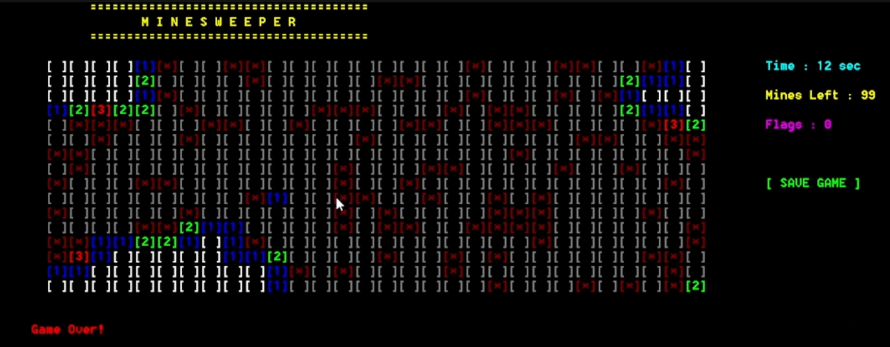

# Minesweeper

A classic Minesweeper game built in C++ for the Windows console, featuring mouse controls, sound effects, and save/load functionality.

## Screenshots

### Main Menu

### Easy Gameplay

### Medium Gameplay

### Hard Gameplay

### Save Game

### Victory

### Game Over

## Features

- Mouse-based gameplay (left click to reveal, right click to flag/unflag)
- Three difficulty levels: Easy, Medium, and Hard
- Automatic reveal of connected empty cells
- Live timer, mine counter, and flag counter
- Sound effects for clicks, flags, victory, and explosions
- Save and load game functionality
- Colored console interface

## Controls

- **Left Click** – Reveal a cell
- **Right Click** – Flag or unflag a cell

Open every safe cell without revealing a mine to win.

## Technologies Used

- C++
- Windows Console API (`windows.h`)
- WinMM (`winmm.lib`) for sound playback

## Running the Project

1. Open the project in Visual Studio.
2. Place all `.wav` sound files in the same directory as the executable.
3. Build and run the project.

## Author

**Muhammad Talha Amin**
